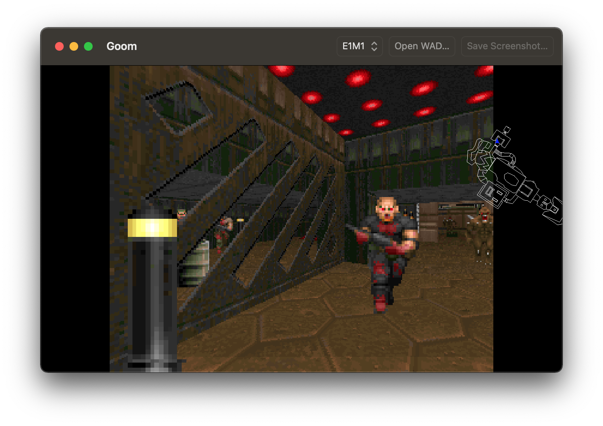

# Goom - A WAD viewer in Swift

Goom is a basic **viewer** of WAD files (the Doom data files) written in Swift. The main purpose is to demonstrate some of the breakthrough technical innovations that were introduced by the Doom egine.

## Install

You will need [Xcode](https://developer.apple.com/xcode/) to compile and run Goom. Open the Xcode project, select the macOS or iOS target, compile and run. The build process automatically downloads the shareware `doom1.wad` and copies it into the `Assets/` folder in the application bundle. Other WAD files can be loaded at runtime.

## How does it work?

See [here](https://secondchoice.github.io/Goom/) for an explanation.
