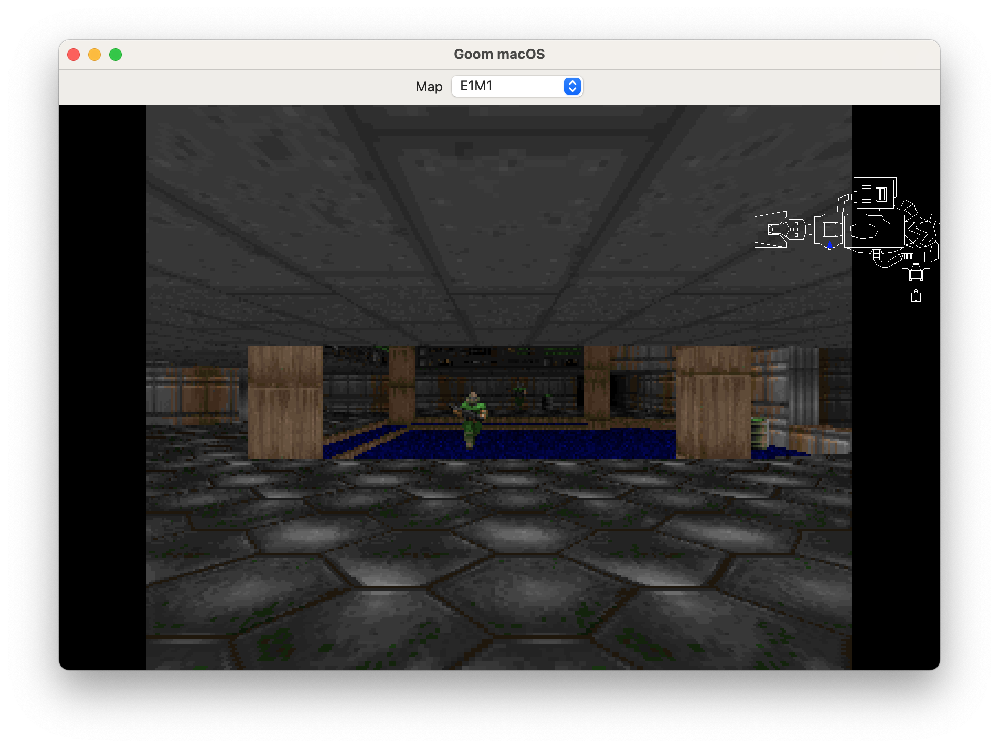

# Goom - A WAD viewer in Swift



Goom is a basic **viewer** (not a game!) of WAD files (the ones used by Doom and related games to store their levels). It is a very short
Swift program demonstrating a modern implementation of these old-school techniques.

## Install

### Download and extract a WAD file

Download `doom1.wad` (shareware) and use the `preprocess.py` python script to extract its content in `Assets/`.

```bash
cd Goom
curl https://distro.ibiblio.org/slitaz/sources/packages/d/doom1.wad -O doom1.wad
python3 Preprocessor/preprocess.py doom1.wad Assets # Requires PIL
```

### Compile and run

Open the Xcode project, select the macOS target, and compile and run the macOS version of the app.
Uploading the iOS version of the app to a device requires enabling code signing.

