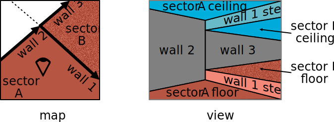
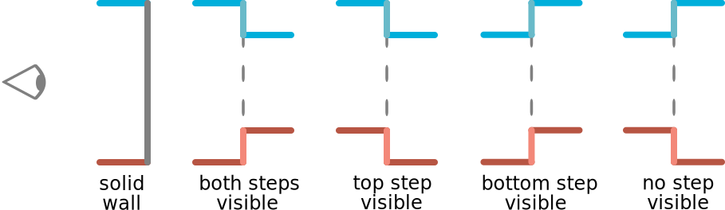
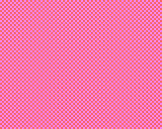
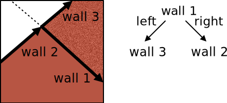
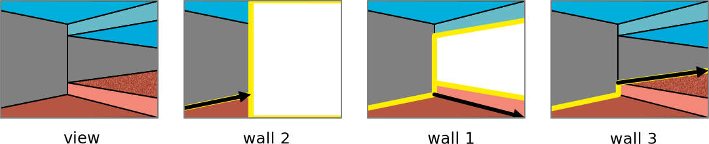

# How the Doom engine works

Doom levels' geometry is described by a 2D map, partitioned into polygonal *sectors*. Seen in 3D, a sector is an area with a flat floor and a flat ceiling, both solid and textured. A side of the polygonal sector is called a LineDef in the Doom engine. Here wee simplify the terminology a bit and call those *walls* because they can correspond to vertical walls, which fill the space from floor to ceiling with a solid texture. However, the wall texture can also be missing (resulting into a transparent wall, also known as a portal in the Doom engine), or it can contain a see-through texture, such as a mesh or a cage.

Each sector specifies the elevation of its floor and ceiling. When these differ between neighbour sectors, step-like structures at the top or bottom of the connecting walls are formed. Like the walls, the vertical steps are also solid and textured. From the viewpoint of the player, in addition to the simple solid wall case, this creates four structures, depending on whether the top and bottom steps face the player or away from him.

For example, the following map defines three walls and two sectors. Wall 1 is open, whereas walls 2 and 3 are solid:

In general, from the viewpoint of the player, an open wall will have from two to no steps visible:

Walls have a thickness of zero (we refer to them as "thin" walls). In maps, the texture of walls (when present) and steps is usually visible from one side only. A "thick" wall, which is visible from two opposite sides, is obtained as a sector sandwiched between two thin walls. While Doom allows to specify different textures for the two sides of the same thin wall, this appears to be redundant. It suffices to specify up to three textures: one for the top step (if any), one for the bottom step (if any), and one for the wall in the middle (which can be missing if the wall is transparent). In actual maps, only see-through thin walls seem to be visible from both sides, but in this case both sides share the same texture, so a different specification is redundant.

The map's geometry is static except for the elevations of floors and ceilings, which can be manipulated at run time to create doors, elevators and other mobile structures.

The map can also represent outdoor areas, where the top portion of the scene is replaced with a sky-like texture. However, this is obtained via a hack: certain ceiling and top step textures are marked as "sky" and replaced with a rendering of the sky in the background (using cylindrical projection). This hack requires a careful design of the level geometry so that the local walls hide all tall structures in the background, as these would be incorrectly hidden by the sky texture.

The engine also supports drawing *things*, which are 2D sprites that appear as flat surfaces always facing the player. These can be moved around arbitrarily and are used to represent dynamic objects such as monsters, bonuses and some static map fixtures.

## Scene drawing

Doom draws the scene starting from the sectors and walls closer to the player followed by the ones farther away, until all pixels are drawn. Specifically, the engine starts from the wall that, from the viewpoint of the player, has no other wall in front of it. Because this wall is not occluded by others, it can be drawn in full. The engine draws this wall, including any step at the bottom or top of it and the portions of floor and ceiling bordering with the wall. Next, the engine searches for a wall that has nothing in front of it except the one just drawn and draws it (including steps, floor and ceiling) skipping pixels already drawn. It iterates these steps until all pixels are draw.

The following animation shows these steps as implemented in Goom. They are similar, but not exactly identical, to the original Doom engine. A main difference is that in Doom floors and ceilings are drawn for better efficiency in a separate phase.

This algorithm is the opposite of the painter's algorithm, where far objects are drawn first followed by the ones closer to the player, simulating occlusions by redrawing pixels. The advantage of Doom's method is that each pixel is drawn only once, and that drawing can stop as soon as all pixels are filled, which generally requires considering only a very small subset of the walls in the map. A disadvantage is the complexity of keeping track of which pixels have already been drawn.

Efficiently keeping track of drawn pixels is quite easy for floors, ceilings, and solid and transparent walls, due to their simple geometry. At any point during the rendering pass, the drawn portion always consist of two "strips", one at the top and one at the bottom of the screen, which can be represented by two coordinates per view column. This bookkeeping is not as easy for see-through textures or things, which are therefore handled differently. For them, the engine first draws all solid/transparent floors, ceilings and walls using the method just described, followed by a second pass where any see-through texture belonging to walls and things are drawn, this time using the painter's algorithm. This is evident in the animation above.

## Binary space partitioning (BSP)

The premise of the drawing method discussed above is that walls can be sorted "by occlusion" from the viewpoint of the player. It is, however, not obvious how this can be achieved: if two walls intersect at an X, none is fully in front of the other.

This problem is solved by fragmenting the geometry (walls and sectors) until all primitives can be sorted by visibility in a well-defined manner. In this process, a *binary space partitioning* (BSP) tree is constructed in order to accelerate rendering. Famously, Doom is one of the first, if not the first, game to make use of a BSP to accelerate 3D rendering.

A BSP node splits the space into two halves, where the split is a line of equation $\langle a, x \rangle + b = 0$, where $x\in\mathbb{R}^2$ is a 2D point, $a \in \mathbb{R}^2$ is a vector orthogonal to the line pointing to its right, and $b \in \mathbb{R}$ is an offset. The positive or right side $S_r$ of the split is given by points $x$ such that $\langle a, x \rangle + b >0$, and similarly for the negative or left side $S_l$.

In the example below, wall 1 is used to define a top-level split in the BSP. Then, wall 2 is to the left of this split and wall 3 to its right:

If the primitives to be drawn (walls, sectors) fall entirely in one of the two sides $S_r$ and $S_l$ specified by such a split, we can sort them by visibility. Specifically, suppose that the player itself is located in region $S_r$. Then, from its viewpoint,  none of the primitives in $S_l$ can occlude any of the primitives in $S_r$ (this is because the line of sight is a straight line and the two regions $S_r$ and $S_l$ are convex). In the algorithm above, one would thus draw all primitives in $S_r$ followed by all primitives in $S_l$.

In general, $S_r$ and $S_l$ will contain several walls, making the choice of which wall to draw next ambiguous. To remove this ambiguity, the space is partitioned recursively until each partition contains a single wall. Going from the root to a leaf of the BSP specifies a sequence of splits that define increasingly smaller regions of space. Ultimately, regions are sufficiently small that they contain a single wall, which can be drawn.

To sort walls for drawing, one thus visits the BSP in a depth-first manner. At each node, one visits first the child on the same side as the player with respect to the node split (the first tree leaf reached in this manner corresponds to the region that contains the player).

For example, in the BPS above, one would draw first wall 2, then wall 1 and, finally, wall 3:

Note the yellow lines, keeping track of the strip not yet drawn in the middle of the image. Note also that each wall draws the portion of ceiling and floor connecting to it on the side of the player.

### Fragmenting the map

A problem with this idea is that walls in a map generally *do not* partition cleanly with respect to planar splits. This problem is solved by *fragmenting* the geometry. When a node is added to the BSP creating a new split, the walls at that node are divided into the ones to the left and to the right of the new split. If a wall straddles the split, it is divided in half, creating a left fragment and a right fragment, that are added to the relative sub-trees.

We can describe the geometry of a wall via two vertices $w=(v_0,v_1)$. The wall is oriented, starting at vertex $v_0 \in \mathbb{R}^2$ and ending at vertex $v_1 \in \mathbb{R}^2$. The wall is given by the 2D points $x(t) = (1-t) v_0 + t v_1$ where the parameter $t$ ranges in the interval $[0,1]$. A *wall fragment* is efficiently represented by specifying a wall $w$ and an interval $[t_0,t_1]\subset[0,1]$ (in an implementation, a fragment contains a pointer to the full wall in order to avoid copying wall attributes such as its textures).

The BSP is constructed by operating on wall fragments. Initially, all walls $w=(v_0,v_1)$ are mapped to corresponding "full fragments" $\tilde w = ((v_0,v_1),[0,1])$. Then, a wall fragment $\tilde w=((v_0,v_1),[t_0,t_1])$ is selected (e.g., at random) and all the other ones are partitioned to be to the left or right of it, using the wall itself to define the split. Specifically, the $\langle a,x\rangle+b=0$ is given by
$$
 a = (v_1 - v_0)^\perp, ~~~ b = - \langle a, v_0 \rangle,
$$
where $(u,v)^\perp = (-v, u)$ denotes 90 degree counterclockwise rotation. Fragments that straddle the cut are further split into two halves. This construction is repeated recursively until each split contains a single fragment.

Once constructed, the BSP structure is immutable. Things are added dynamically to the BSP at run time. They are fragmented as needed, but do not create further splits; instead, they are stored at the corresponding leaves. If multiple thing fragments end up being associated to the same leaf, they are further sorted by decreasing depth for drawing in the second pass.

